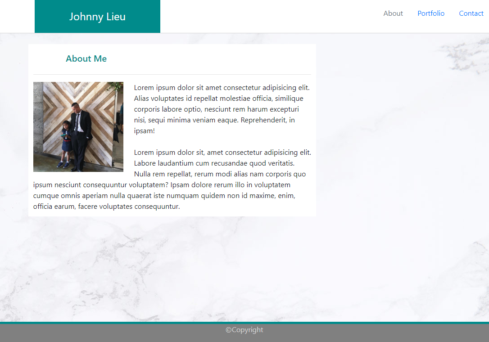
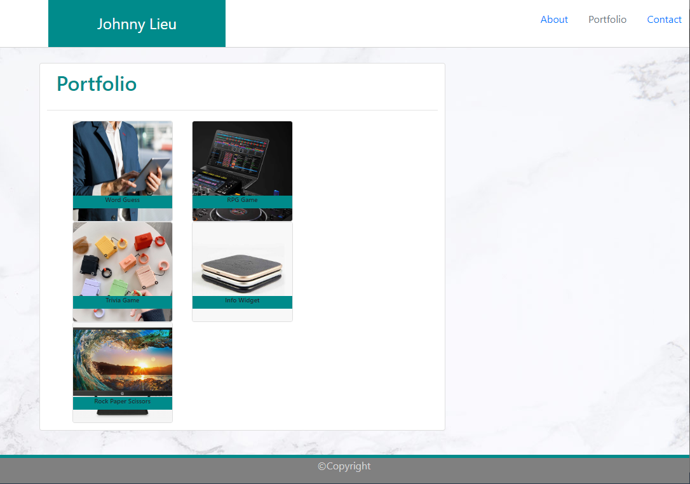
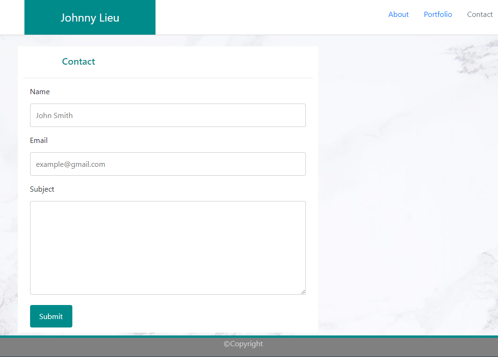

## About Johnny Lieu

## Summary

This is the start of a website about me, my portfolio and contact info.

(Currently still under construction)

https://johnnylieu.github.io/Bootstrap-homework/

## History

https://github.com/johnnylieu/Bootstrap-homework/commits/master

## Screenshots

This is a preview of my "About Me" page:

This is a preview of my "Portfolio" page:

This is a preview of my "Contact" page:

## Credits
Special thanks to Elma Gonzalez, Steven Landgraf & Kira Lowrey.

https://guides.github.com/features/mastering-markdown/

## License
 
* © 2019 Trilogy Education Services, a 2U, Inc. brand. All Rights Reserved.
* © UCSD Coding Bootcamp
